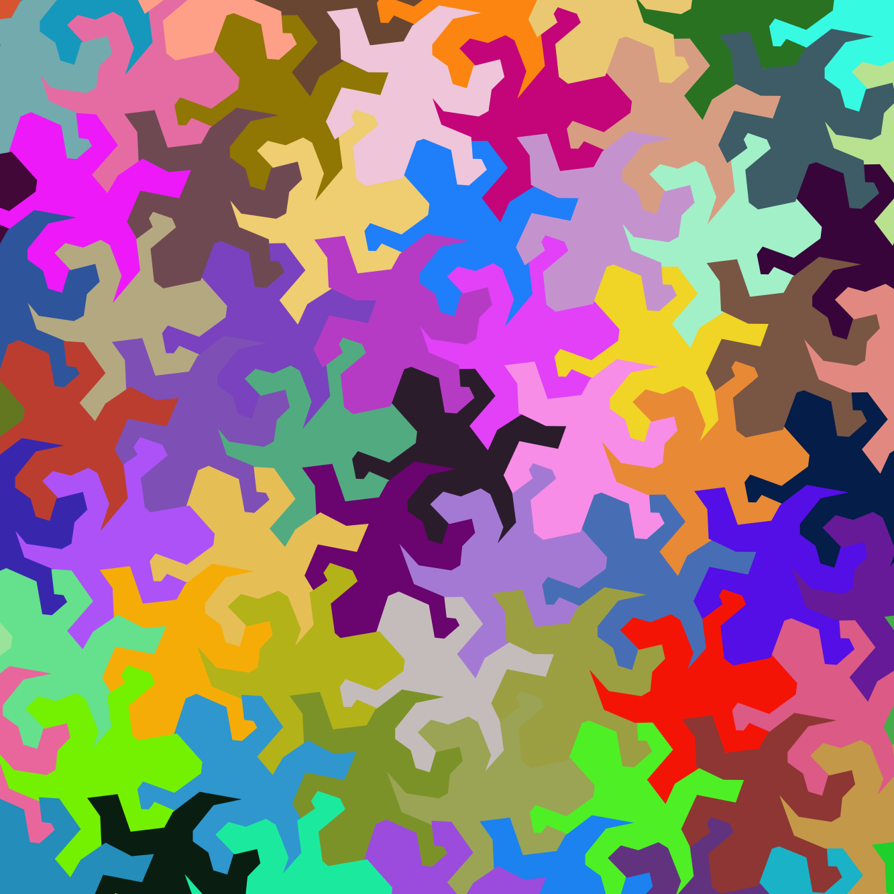

Gallery of programmed art and animations

art/ - this folder contains the finished products: .gifs and images

src/ - this folder contains the source files to create everything in art/, as well as a description in the files themselves. 

This repository showcases some simple, art-like things generated using python. It's mostly just for me to play around in. 

Gallery: 

          

